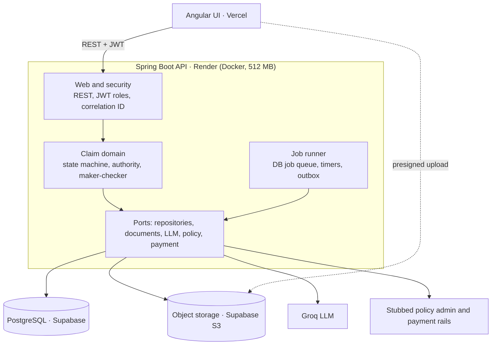
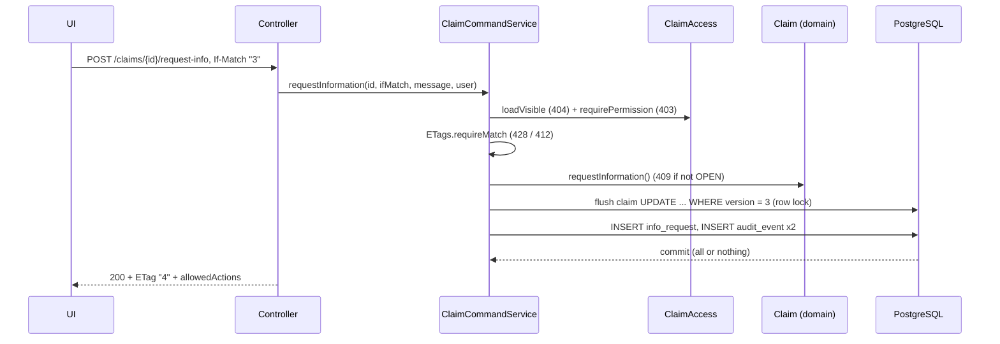
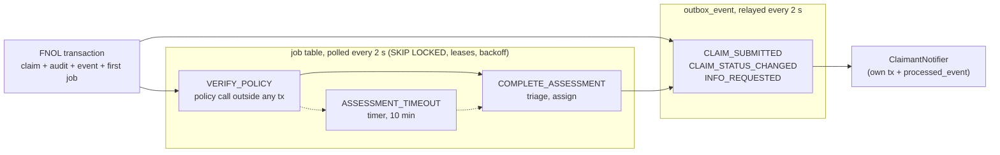
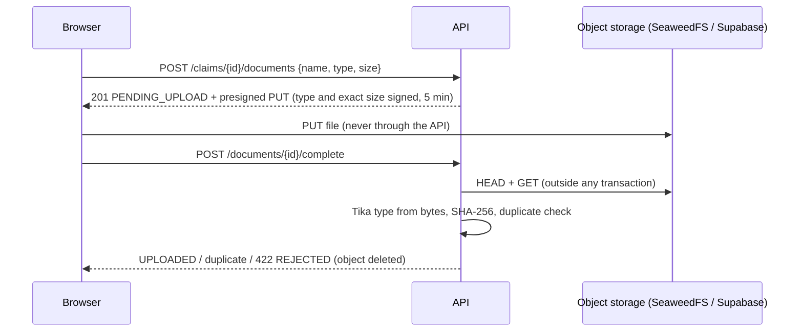
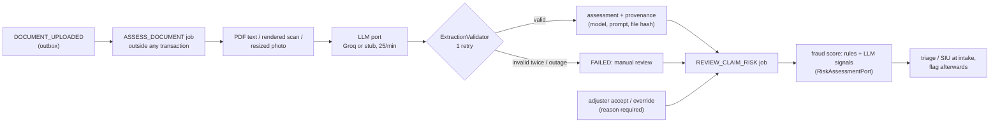
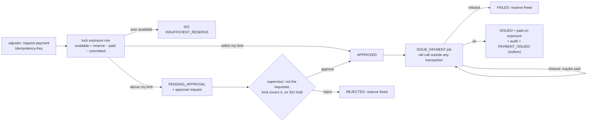
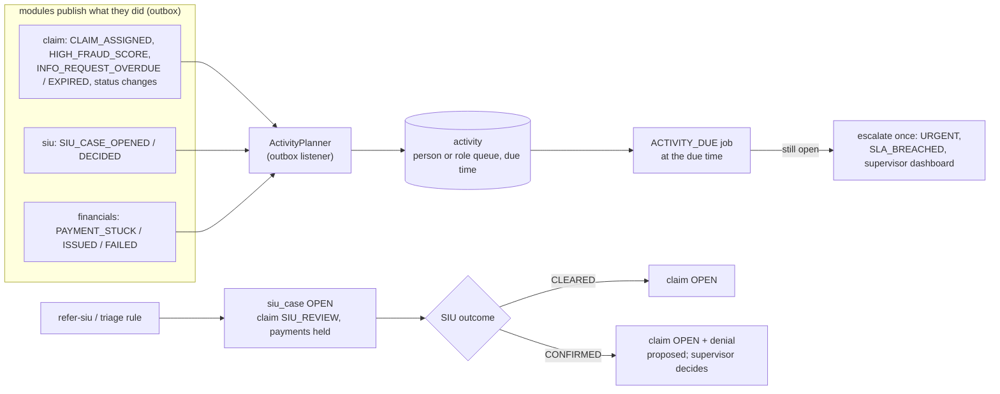
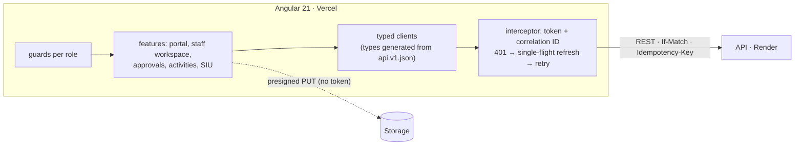

# Architecture

A modular monolith: one Spring Boot API owns all claim state in PostgreSQL. The Angular UI, document
storage, the LLM and the stubbed external systems connect through ports. Full design:
[design/design-document-v1.md](design/design-document-v1.md).

## Modules

| Module | Responsibility | Since |
|---|---|---|
| `common` | error model, correlation ID, clock, OpenAPI | phase 1 |
| `identity` | users, roles, login, JWT, refresh tokens, current user | phase 1 |
| `claim` | FNOL, claim state machine, policy check, triage, assignment, notes, portal and staff APIs | phase 2 |
| `policy` | policy port and stub adapter | phase 2 |
| `audit` | append-only audit trail, claim timeline | phase 2 |
| `platform` | idempotency keys; job queue, timers, ops API; transactional outbox and relay; housekeeping | phase 2–3 |
| `notification` | in-app claimant notifications, fed only by claim events | phase 3 |
| `document` | storage port (S3 adapter), presigned upload/download, verification (type, size, hash), document lifecycle | phase 4 |
| `ai` | LLM port (Groq, stub), document preparation, extraction + validation, fraud score (implements the claim module's `RiskAssessmentPort`), human review | phase 5 |
| `financials` | exposures, reserves, payments, recoveries, authority limits, maker-checker approvals, payment rail port (implements the claim module's `ClaimFinancialsPort`) | phase 6 |
| `siu` | SIU cases: referral (rule, manual), case-based visibility, outcome (implements the claim module's `SiuReferralPort`) | phase 7 |
| `activity` | tasks created from outbox events, SLA timers and escalation, supervisor dashboard | phase 7 |

Layers inside every module: `api` → `app` → `domain`, with `infra` for adapters and `config` for wiring.
Rules enforced by `ArchitectureTest` ([ADR-0002](adr/0002-modular-monolith-with-enforced-boundaries.md)).

## Request path (phase 1)

1. `CorrelationIdFilter` (first filter) accepts or creates `X-Correlation-Id` and puts it in the MDC.
2. Spring Security validates the bearer JWT (signature, expiry, issuer) and maps `role` to `ROLE_*`.
   Failures return a 401/403 `ApiError` from `SecurityErrorHandlers`.
3. The controller calls an application service; the service opens the transaction.
4. Exceptions become an `ApiError` in `GlobalExceptionHandler`.

## A claim command (phase 2)

Every command also appends its audit entries and outbox events in that same transaction.

## Background work (phase 3)

- Jobs commit with the change that needs them; handlers are idempotent; DONE only while holding the
  lease ([ADR-0016](adr/0016-database-job-queue.md)).
- Events commit with the change they describe; each listener handles each event once
  ([ADR-0017](adr/0017-transactional-outbox-with-in-process-relay.md)).
- Intake is a chain of jobs; FNOL answers immediately
  ([ADR-0018](adr/0018-claim-intake-as-jobs.md)).

## Document upload (phase 4)

See [ADR-0019](adr/0019-documents-presigned-upload-and-verification.md).

## AI assessment (phase 5)

The claim module defines `RiskAssessmentPort`; the ai module implements it, so modules stay acyclic
([ADR-0022](adr/0022-explainable-fraud-score-behind-a-port.md)). The model never decides
([ADR-0021](adr/0021-ai-suggests-people-decide.md)).

## Money and approvals (phase 6)

The claim module asks `ClaimFinancialsPort` whether it may close or be withdrawn, and financials
implements it. A denial is proposed by the adjuster and applied by the approving supervisor
([ADR-0024](adr/0024-financials-exposures-reserves-payments-and-maker-checker.md)). Concurrent payments
on one exposure are serialised by a row lock ([ADR-0025](adr/0025-pessimistic-lock-on-the-exposure-for-payments.md)).

## SIU and activities (phase 7)

No module calls the activity module: tasks follow from events
([ADR-0027](adr/0027-activities-from-events-with-sla-timers.md)). The claim module defines
`SiuReferralPort` and SIU implements it; investigators see only claims with a case
([ADR-0026](adr/0026-siu-cases-behind-a-port-with-case-based-visibility.md)).

## Web app (phase 8)

The UI renders the server's `allowedActions` and sends back the ETag it read. It holds the access token
in memory and the refresh token in sessionStorage
([ADR-0029](adr/0029-spa-token-handling-and-a-typed-client-from-the-contract.md)). It calls the API
directly with CORS ([ADR-0030](adr/0030-deployment-topology-and-build-time-api-url.md)).

## Key decisions

See the [ADR index](adr/README.md). The most important:
[database state machine instead of Camunda](adr/0006-database-state-machine-instead-of-a-workflow-engine.md),
[JWT with rotating refresh tokens](adr/0004-jwt-access-tokens-and-rotating-refresh-tokens.md) and
[free-tier hosting](adr/0007-free-tier-hosting.md).
