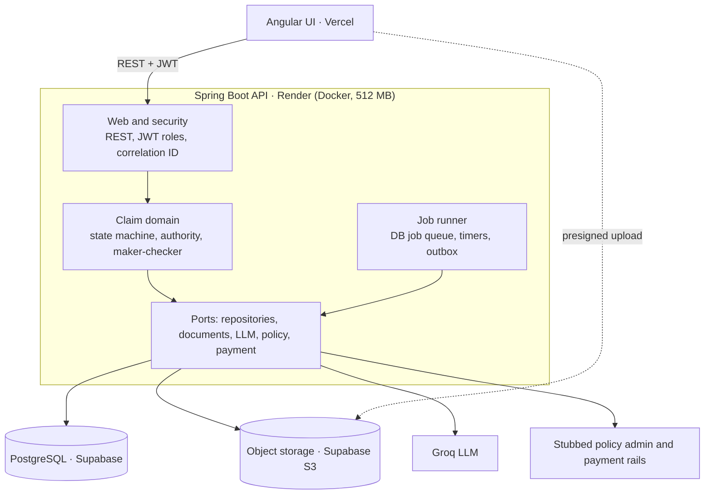
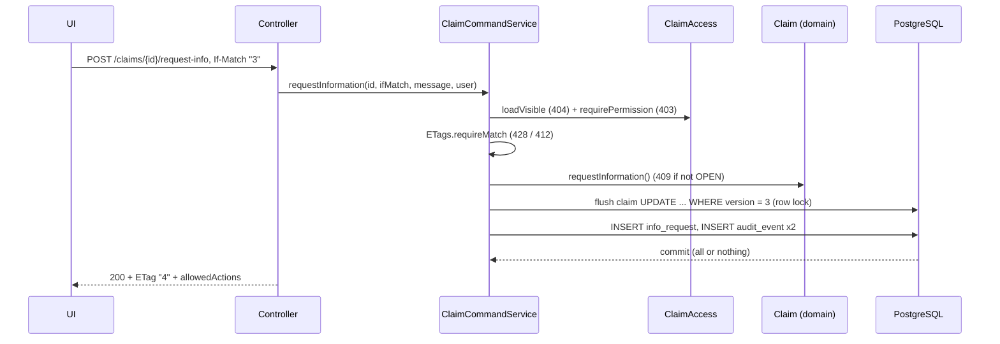

# Architecture

A modular monolith: one Spring Boot API owns all claim state in PostgreSQL. The Angular UI, document
storage, the LLM and the stubbed external systems connect through ports. Full design:
[design/design-document-v1.md](design/design-document-v1.md).

## Modules

| Module | Responsibility | Since |
|---|---|---|
| `common` | error model, correlation ID, clock, OpenAPI | phase 1 |
| `identity` | users, roles, login, JWT, refresh tokens, current user | phase 1 |
| `claim` | FNOL, claim state machine, policy check, triage, assignment, notes, portal and staff APIs | phase 2 |
| `policy` | policy port and stub adapter | phase 2 |
| `audit` | append-only audit trail, claim timeline | phase 2 |
| `platform` | idempotency keys (phase 2); job queue, timers, transactional outbox (phase 3) | phase 2 |
| `document` | storage port, presigned URLs, document lifecycle | phase 4 |
| `ai` | LLM port, extraction, damage assessment, fraud score | phase 5 |
| `exposure`, `payment`, `approval` | reserves, payments, authority limits, maker-checker | phase 6 |
| `siu`, `activity` | fraud investigations, tasks, SLA escalation | phase 7 |

Layers inside every module: `api` → `app` → `domain`, with `infra` for adapters and `config` for wiring.
Rules enforced by `ArchitectureTest` ([ADR-0002](adr/0002-modular-monolith-with-enforced-boundaries.md)).

## Request path (phase 1)

1. `CorrelationIdFilter` (first filter) accepts or creates `X-Correlation-Id` and puts it in the MDC.
2. Spring Security validates the bearer JWT (signature, expiry, issuer) and maps `role` to `ROLE_*`.
   Failures return a 401/403 `ApiError` from `SecurityErrorHandlers`.
3. The controller calls an application service; the service opens the transaction.
4. Exceptions become an `ApiError` in `GlobalExceptionHandler`.

## A claim command (phase 2)

FNOL runs the same way, plus the idempotency record and, in phase 2, the intake steps (policy check,
triage, assignment) in the same transaction
([ADR-0014](adr/0014-synchronous-intake-until-the-job-queue.md)).

## Key decisions

See the [ADR index](adr/README.md). The most important:
[database state machine instead of Camunda](adr/0006-database-state-machine-instead-of-a-workflow-engine.md),
[JWT with rotating refresh tokens](adr/0004-jwt-access-tokens-and-rotating-refresh-tokens.md) and
[free-tier hosting](adr/0007-free-tier-hosting.md).
