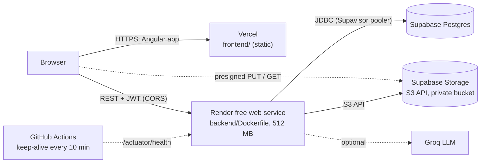

# Deployment: Supabase + Render + Vercel (free tier)

The target is ADR-0007: no payment card, no cost. About 30 minutes, in this order (each step needs a
value from the one before).

## 1. Supabase: database and storage

1. Create a project at supabase.com (free plan). Choose a region near your users; note the
   **database password**.
2. **Database URL:** Project Settings → Database → Connection string → **Session pooler**
   (port 5432; the direct connection is IPv6-only, which Render can't reach). Split it into:
   - `DB_URL` = `jdbc:postgresql://aws-0-<region>.pooler.supabase.com:5432/postgres?sslmode=require`
   - `DB_USERNAME` = `postgres.<project-ref>`
   - `DB_PASSWORD` = the database password
3. **Bucket:** Storage → New bucket `aiclaims-documents`, **private** (not public). Browsers only ever
   use presigned URLs.
4. **S3 keys:** Storage → Settings → S3 connection → enable, then "New access key":
   - `STORAGE_ENDPOINT` = `https://<project-ref>.supabase.co/storage/v1/s3`
   - `STORAGE_REGION` = the region shown there (e.g. `ap-south-1`)
   - `STORAGE_ACCESS_KEY` / `STORAGE_SECRET_KEY` = the new key pair (the secret is shown once)

5. **Turn off the Data API:** Project Settings → Data API → disable it (or remove `public` from the
   exposed schemas). The app talks to Postgres only over JDBC. Supabase would otherwise publish every
   table in `public` over REST, and Flyway-created tables have no row-level security.

Flyway creates the schema and the demo users on the first start (`db/migration` + `db/demo`). For a
deployment without demo users, set `FLYWAY_LOCATIONS=classpath:db/migration`.

## 2. Render: the API

1. render.com → New → **Blueprint** → connect the GitHub repository. Render reads `render.yaml` and
   creates `ai-claims-api` (Docker, free plan, health check `/actuator/health`).
2. Fill in the values it asks for:
   - the DB and STORAGE values from step 1
   - `CORS_ALLOWED_ORIGINS`: put a placeholder now; you set it in step 4
   - `API_PUBLIC_URL`: the service URL Render shows, e.g. `https://ai-claims-api.onrender.com`
   - `GROQ_API_KEY`: optional; with `AI_PROVIDER=groq` documents are read by the real model, with `stub`
     (the default) by a deterministic stand-in

   `JWT_SECRET` is generated by Render.
3. Deploys wait for CI: `autoDeployTrigger: checksPass` makes Render deploy a commit on `main` only
   after its GitHub checks pass (the `CI` workflow: backend tests, contract check, frontend build,
   Docker image). A red build never reaches production. To ship without waiting, use "Manual Deploy"
   in the dashboard.
4. First deploy: the image builds in about 5 minutes. Check `https://<service>/actuator/health` →
   `{"status":"UP"}`.

## 3. Vercel: the UI

1. vercel.com → Add New → Project → import the repository.
2. **Root Directory:** `frontend`. Framework preset: *Other*. `vercel.json` sets the build
   (`npm run build:prod`), the output (`dist/frontend/browser`) and the SPA rewrite.
3. **Environment variable:** `API_URL` = the Render URL from step 2 (https, no trailing slash).
   `scripts/write-env.mjs` bakes it into the build and fails the build if it's missing.
4. Deploy, and note the site URL, e.g. `https://ai-claims.vercel.app`.

## 4. Connect them

1. Render → `ai-claims-api` → Environment → `CORS_ALLOWED_ORIGINS` = the Vercel URL (exact origin,
   comma-separated for several) → save (it redeploys).
2. GitHub → repository → Settings → Secrets and variables → Actions → **Variables** → `API_URL` = the
   Render URL. The `Keep alive` workflow then pings every 10 minutes. The health check touches the
   database, so it also keeps Supabase from pausing.

## 5. Check it (5 minutes)

| Step | Expected |
|---|---|
| Open the Vercel URL (first call may take ~1 min: cold start) | login page |
| "Claimant" demo button | My claims |
| Report a loss on `POL-AUTO-1001`, upload a PDF | "Claim ... was received", document **Processed** within seconds |
| Log in as `adjuster1` or `adjuster2` (the one assigned) → the claim → Financials | exposure and payment within ₹5,000 become **Issued** |
| As `supervisor1` → Approvals | requests above ₹5,000, approve → issued |
| Browser dev tools → Network | API calls carry `Authorization`; the storage PUT does not |

If the upload fails with a CORS error, Supabase Storage must allow the Vercel origin for PUT. It allows
any origin by default; check the project's storage CORS settings.

## Costs and limits

- Everything above is on free plans. Render sleeps after 15 idle minutes (the keep-alive prevents that
  within GitHub's schedule jitter). Supabase pauses after about 7 idle days.
- GitHub Actions minutes: public repositories are free; the keep-alive uses about 1 minute per run.
- Groq's free tier allows about 30 requests per minute. The API limits itself to 25 (ADR-0023).

## Security notes

- Secrets exist only in Render's and Vercel's settings (`sync: false` in `render.yaml`), never in the
  repository. Rotate any key that was ever pasted into a chat or a ticket.
- The demo users and their shared password are public (they are in the README). That's fine for a demo,
  not for real data: set `FLYWAY_LOCATIONS=classpath:db/migration` and seed real users another way.
