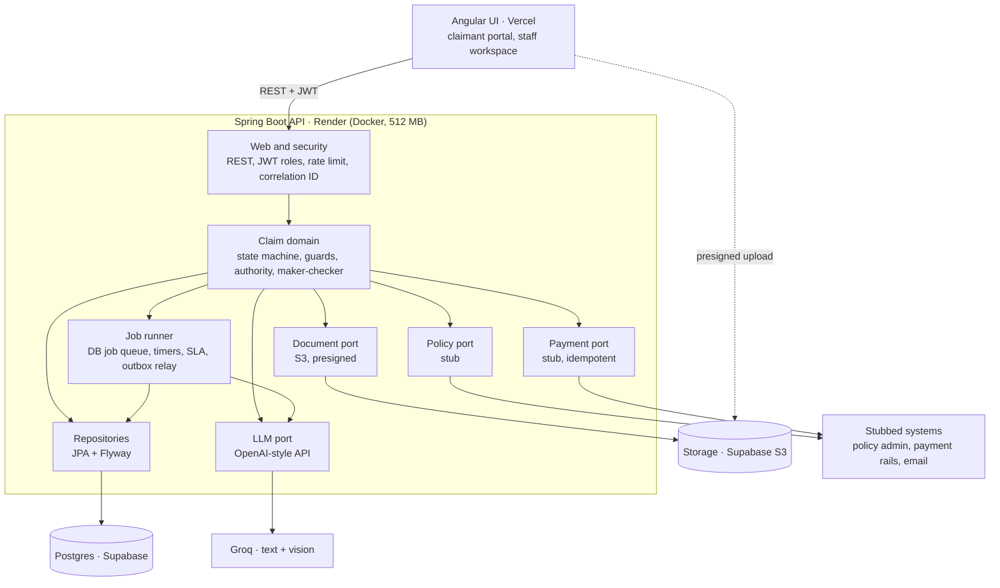
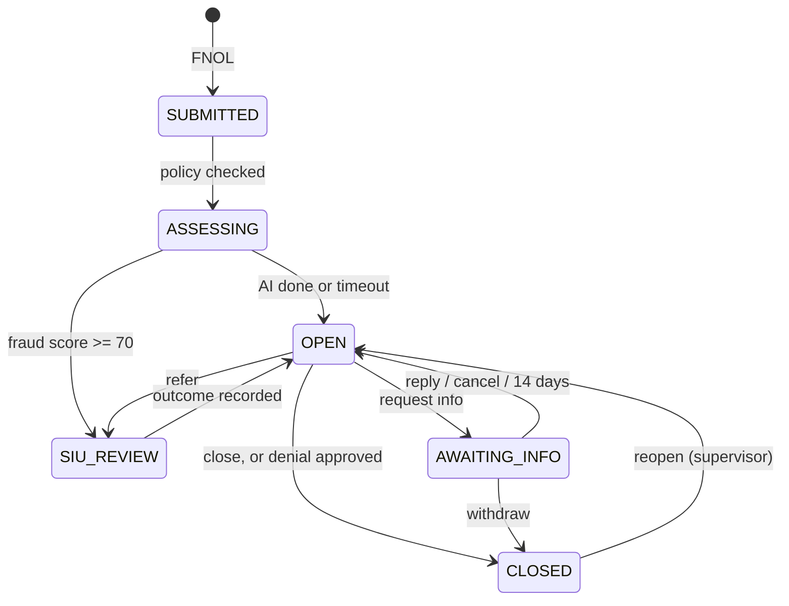

# AI Claims Platform: Design Document (v1)

Sep 28, 2026 · @Rajdeep

## 1. Overview

A standalone, Guidewire ClaimCenter-style insurance claims platform: Spring Boot backend, Angular UI and an AI document assistant (Groq). It replaces Camunda with a database-backed claim state machine. It's a learning and interview project, built to production standards on free-tier hosting.

**Goals**

- Model real claims handling: FNOL, exposures, reserves, payments, activities, SIU referral and subrogation recovery.
- Enforce real controls: role-based access, authority limits, maker-checker, SIU payment hold, full audit trail.
- Run long-running workflow without an engine: state machine, database job queue, timers, transactional outbox.
- Use AI safely: the LLM extracts and suggests, rules and humans decide, every AI output is validated and overridable.
- Deploy end to end for free: Vercel (UI), Render (API), Supabase (Postgres + storage), Groq (LLM).

**Scope**

| Area | v1 | v2 (later) |
| --- | --- | --- |
| Roles | Claimant, Adjuster, Supervisor, SIU | Admin UI, Recovery specialist, FNOL call-centre rep |
| Claim | FNOL, 6-state lifecycle, reopen | Straight-through payment for small clean claims |
| Money | One reserve per exposure, payments with approval, recovery amount | Reserve lines by cost type, salvage, deductible refunds |
| AI | Document classification and extraction, damage estimate, fraud signals | Chat assistant for adjusters, claim summaries |
| Workflow | Activities, SLA timers, escalation | Configurable SLAs, business-editable rules |
| UI updates | Polling | Server-sent events |

**Non-goals:** real policy administration, real payment rails, multi-tenancy, a mobile app. Policy and payment systems are stubbed behind ports.

## 2. Tech stack and deployment

Everything runs on free tiers with no card: Vercel serves the Angular UI, Render runs the Spring Boot API in Docker, and Supabase provides Postgres plus S3-compatible document storage.

| Layer | Technology | Local dev | Cloud (free) |
| --- | --- | --- | --- |
| UI | Angular (standalone components, signals), theme supplied later | `ng serve` | Vercel |
| API | Java 17, Spring Boot 3, Spring Security (JWT), Spring Data JPA, Flyway | IDE / Docker | Render web service (Docker, 512 MB) |
| Database | PostgreSQL 16 | docker-compose | Supabase Postgres via Supavisor pooler (session mode, port 5432) |
| Documents | S3 API (AWS SDK v2) | MinIO in docker-compose | Supabase Storage (S3-compatible, 1 GB, 50 MB per file) |
| Text extraction | tika-core (type detection) + Apache PDFBox | in-process | in-process |
| LLM | Groq, OpenAI-compatible API (text + vision model) | Groq or stub | Groq |
| Rate limiting | Bucket4j | in-process | in-process |
| Build and CI | Maven, JUnit 5, Testcontainers, GitHub Actions |  | GitHub Actions |
| Keep-alive | UptimeRobot / cron-job.org pinging `/actuator/health` |  | every 10 min |

**Free-tier constraints designed for**

- **Render sleeps after 15 min idle.** All timers and jobs are database rows with a `due_at`, so work resumes when the app wakes. A pinger keeps it warm.
- **512 MB RAM.** `-XX:MaxRAMPercentage=75 -XX:+UseSerialGC`, tika-core only (no full parser bundle), Hikari pool of 5, no Kafka.
- **Supabase pauses after \~7 days without activity.** The health check queries the database; check the dashboard weekly.
- **Supabase direct connection is IPv6-only.** Use the Supavisor pooler URL; in transaction mode add `prepareThreshold=0`.
- **Groq free-tier rate limits.** Throttle AI jobs with Bucket4j, back off on HTTP 429, never block the claim on the AI.

Code depends only on standard protocols (JDBC, S3, OpenAI-compatible HTTP) behind ports, so each vendor can be swapped by configuration.

## 3. Architecture

A modular monolith: one Spring Boot API owns all claim state in Postgres. The UI, document storage, the LLM and the stubbed external systems all connect through ports.



Documents go straight from the browser to storage through a presigned URL. The API only records metadata and queues AI jobs.

**Key patterns**

| Pattern | Where | Why |
| --- | --- | --- |
| Database state machine | Claim, Exposure, Payment, Activity, Document | Replaces Camunda; one transaction per transition, invalid moves return 409 |
| Ports and adapters | Storage, LLM, policy, payment, notification | Swap vendor or stub by profile; test without network |
| Transactional outbox | Domain events to notifications and follow-up work | State change and event commit together; no dual writes |
| Database job queue (`FOR UPDATE SKIP LOCKED`) | Policy check, AI processing, SLA timers, reminders | Survives restarts and Render sleep; retries with backoff |
| Optimistic locking (`@Version`, ETag / If-Match) | Claim, Payment | Concurrent edits return 409 / 412 instead of lost updates |
| Idempotency keys | FNOL submit, payment issue | Client and job retries never create duplicates |
| Modules by domain, checked by ArchUnit | identity, claim, exposure, payment, activity, document, ai, siu, audit | Boundaries enforced by tests, not just package names |

Why not microservices: one team, one domain, free hosting with 512 MB. Modules with clean ports can be split out later if a part needs to scale on its own.

## 4. Roles and permissions

Four roles in v1. Authority limits and all users are seeded by a Flyway migration; there is no admin UI, so nobody can raise their own limit from the app.

| Role | Responsibilities | Authority limit | Demo user |
| --- | --- | --- | --- |
| CLAIMANT | Reports the loss (FNOL), uploads documents, answers information requests, tracks status, can withdraw | none | `claimant1` |
| ADJUSTER | Owns the claim: coverage check, exposures, reserves, reviews AI output, payments within limit, SIU referral, records subrogation recovery, closes the claim | 5,000 | `adjuster1` |
| SUPERVISOR | Approves over-limit reserves and payments and every denial, reassigns claims, watches queues and SLA breaches, reopens claims | 50,000 | `supervisor1` |
| SIU | Investigates fraud referrals and records the outcome (cleared / confirmed) | none (cannot pay) | `siu1` |

**Permission matrix**

| Action | Claimant | Adjuster | Supervisor | SIU |
| --- | --- | --- | --- | --- |
| Submit FNOL, upload documents | own claims | yes | yes | no |
| View a claim | own, limited fields | assigned | team | referred |
| See fraud score, AI output, internal notes | no | yes | yes | yes |
| Create exposures, set reserves | no | within limit | within limit | no |
| Request a payment | no | yes | yes | no |
| Approve an over-limit amount | no | no | yes, never own request | no |
| Deny a claim | no | request | approve | recommend |
| Refer to SIU | no | yes | yes | n/a |
| Record SIU outcome | no | no | no | yes |
| Reassign, reopen | no | no | yes | no |

**Control rules (enforced on the server)**

1. **Maker-checker:** the approver of a request must be a different user from its requester.
2. **Authority limits** are read from the database at decision time, not from the JWT, so a change applies immediately.
3. **SIU hold:** no payment can be approved or issued while the claim is in SIU\_REVIEW.
4. **Denials** always need supervisor approval; the system never denies automatically.
5. **Field-level visibility:** claimant responses are separate DTOs that never contain fraud scores, AI output, reserves or internal notes.
6. **Audit:** every transition, approval, AI override and amount change records who, when, old value, new value and reason.
7. **Segregation of duties:** SIU cannot pay; supervisors cannot approve their own requests.

## 5. Domain model

The model follows Guidewire ClaimCenter: a Claim is one loss event on one policy, and money is handled per Exposure (one claimant × one coverage). Entities are rich (behaviour inside, no public setters); state only changes through domain methods.

| Entity | Belongs to | Key fields | Invariants |
| --- | --- | --- | --- |
| **Claim** (aggregate root) | Policy (by number) | claimNumber, policyNumber, lossDate, lossType, description, status, closeOutcome, segment (FAST\_TRACK / STANDARD / COMPLEX), fraudScore, assignedAdjuster, version | Status changes only through the state machine; lossDate not in the future |
| **Exposure** | Claim | type (VEHICLE\_DAMAGE / PROPERTY / INJURY), claimant, coverage, status (OPEN / CLOSED) | Closing releases the remaining reserve |
| **Reserve** | Exposure (one per exposure in v1) | amount, updatedBy | Increase above the actor's limit needs approval; never below payments made |
| **Payment** | Exposure | amount, payee, status, idempotencyKey, requestedBy, approvedBy, externalRef | amount ≤ remaining reserve; approver ≠ requester; blocked in SIU\_REVIEW |
| **Recovery** | Claim | amount, source (third party / insurer), receivedAt | Only on a claim with at least one issued payment |
| **Activity** | Claim | type, subject, assignee, candidateRole, dueAt, priority, status, linkedEntity | The replacement for Camunda user tasks; overdue ones escalate |
| **ApprovalRequest** | Claim | kind (PAYMENT / RESERVE / DENIAL), amount, reason, requestedBy, decidedBy, decision | Decided once; decider ≠ requester; decider's limit ≥ amount |
| **Document** | Claim | storageKey, fileName, contentType, sizeBytes, sha256, docType, status, uploadedBy | Unique (claimId, sha256) blocks duplicate uploads |
| **AiAssessment** | Document or Claim | kind (EXTRACTION / DAMAGE / FRAUD), model, output JSON, confidence, accepted, overriddenBy, overrideReason | Override requires a reason |
| **SiuCase** | Claim | referredBy, reason, source (RULE / MANUAL), investigator, outcome, findings | At most one open case per claim |
| **Note** | Claim | body, author, internal flag | Internal notes never reach the claimant |
| **AuditEvent** | any entity | entityType, entityId, action, actor, oldValue, newValue, reason, correlationId, at | Append-only |
| **User** | n/a | username, passwordHash, role, authorityLimit | Seeded in v1 |
| **Policy** (stub) | n/a | policyNumber, holder, status, coverages, limits, deductible | Read through the policy port |

Two technical tables support the workflow: **Job** (async work and timers) and **OutboxEvent** (domain events). They are described in section 8.

## 6. Claim lifecycle

The claim has six coarse states; the detail lives in the smaller lifecycles of payments, exposures, activities and documents. CLOSED is one state with an outcome, because paid, denied and withdrawn claims all behave the same.



The system never denies a claim. An unverified policy or a high fraud score leads to review; every denial passes supervisor approval.

**Transitions**

| # | From → To | Trigger | Who | Guards | Side effects |
| --- | --- | --- | --- | --- | --- |
| 1 | – → SUBMITTED | FNOL submitted | Claimant, Adjuster | Policy number, loss date not in future, description, idempotency key | Claim number, audit, job VERIFY\_POLICY |
| 2 | SUBMITTED → ASSESSING | Policy check done | System | – | Flag if unverified (no auto-deny); job PROCESS\_DOCUMENT per document, job FRAUD\_SCORE |
| 3 | ASSESSING → OPEN | All AI jobs done, or 10 min timeout | System | Fraud score < 70 | Triage → segment → assign adjuster → activity "First contact" (24 h; fast-track 4 h) |
| 4 | ASSESSING → SIU\_REVIEW | Fraud score ≥ 70 | System | – | SiuCase (source RULE), SIU activity, adjuster still assigned |
| 5 | OPEN → AWAITING\_INFO | Request information | Adjuster | Message required | Notify claimant; timers: reminder 3 days, escalation 7 days, return 14 days |
| 6 | AWAITING\_INFO → OPEN | Claimant replies, adjuster cancels, or 14 days pass | Claimant, Adjuster, System | – | New documents → AI jobs; on timeout, activity "No response: decide" |
| 7 | OPEN → SIU\_REVIEW | Manual referral | Adjuster, Supervisor | Reason required, no open SiuCase | SiuCase (source MANUAL), SIU activity |
| 8 | SIU\_REVIEW → OPEN | Outcome recorded | SIU | Outcome + findings | Cleared → normal handling; confirmed → denial ApprovalRequest to supervisor |
| 9 | OPEN → CLOSED (PAID / NO\_PAYMENT) | Close claim | Adjuster | All exposures closed, no pending payments or approvals | Release remaining reserves, notify claimant |
| 10 | OPEN → CLOSED (DENIED) | Denial approved | Supervisor | Approver ≠ requester | Denial notification with reason |
| 11 | OPEN / AWAITING\_INFO → CLOSED (WITHDRAWN) | Claimant withdraws | Claimant | No payment issued | Cancel open activities and jobs |
| 12 | CLOSED → OPEN | Reopen | Supervisor | Reason required | Activity for the adjuster |

Any other move returns **409 Conflict** with code `INVALID_TRANSITION`.

**What the claimant sees**

| Internal state | Claimant status |
| --- | --- |
| SUBMITTED, ASSESSING | Received |
| OPEN | In review |
| AWAITING\_INFO | Action needed |
| SIU\_REVIEW | In review (a fraud investigation is never revealed) |
| CLOSED | The outcome: Paid, Denied, Withdrawn, Closed without payment |

**Sub-lifecycles**

| Entity | States | Rules |
| --- | --- | --- |
| Payment | REQUESTED → APPROVED → ISSUED; REQUESTED → PENDING\_APPROVAL → APPROVED or REJECTED; ISSUED ↔ FAILED (retry) | Within the requester's limit it auto-approves; retries reuse the idempotency key |
| ApprovalRequest | PENDING → APPROVED or REJECTED | Decided once, by a different user with enough authority |
| Exposure | OPEN → CLOSED | Close releases the remaining reserve |
| Activity | OPEN → COMPLETED or CANCELLED | Overdue → copy to the supervisor queue, priority raised |
| Document | UPLOADED → PROCESSING → PROCESSED or FAILED | FAILED never blocks the claim; the adjuster reviews manually |
| SiuCase | OPEN → CLEARED or CONFIRMED | One open case per claim |

## 7. Feature flows

Each flow below is what one demo click-path exercises. Every numbered step that changes data is one database transaction.

### F1. Login

1. User posts username and password to `/api/v1/auth/login`.
2. API checks the BCrypt hash and returns an access JWT (15 min, claims: sub, role) and a refresh token (7 days, stored hashed, rotated on use).
3. Angular keeps the access token in memory and attaches it via an HTTP interceptor; a 401 triggers one refresh attempt, then logout.

### F2. FNOL and document upload

1. Claimant fills the FNOL wizard: policy number, loss date, loss type, location, description, parties.
2. Angular sends `POST /claims` with an `Idempotency-Key` header. A repeat with the same key returns the original claim.
3. API creates the Claim (SUBMITTED), an AuditEvent, and a VERIFY\_POLICY job, in one transaction. Returns 201 with the claim number.
4. For each file, Angular calls `POST /claims/{id}/documents/upload-url` with name, type and size. API validates type and size (10 MB), creates a Document (UPLOADED, pending) and returns a presigned PUT URL valid 5 min.
5. Browser uploads directly to storage, then calls `POST /documents/{id}/complete`.
6. API checks the object exists, re-detects the real type from its first bytes (Tika), stores the SHA-256, and queues a PROCESS\_DOCUMENT job.

### F3. Policy check and AI assessment

1. VERIFY\_POLICY job calls the policy port: status on the loss date, coverage for the loss type, limits, deductible.
2. Valid: claim → ASSESSING. Not found or lapsed: claim → ASSESSING with flag POLICY\_UNVERIFIED for the adjuster.
3. PROCESS\_DOCUMENT jobs run the AI pipeline (section 11) and store an AiAssessment per document.
4. When all document jobs finish, a FRAUD\_SCORE job combines rule signals and the LLM's signals into a 0–100 score with reasons.
5. An ASSESSMENT\_TIMEOUT job due in 10 min moves the claim on if the AI is slow or down (flag AI\_UNAVAILABLE).

### F4. Triage and assignment

1. Triage rules run on: fraud score, estimated amount, loss type, injury present, policy flags.
2. Result: FAST\_TRACK (e.g. estimate < 2,000, fraud < 20, no injury, policy valid), COMPLEX (injury, estimate > 25,000, or policy unverified), else STANDARD.
3. Fraud ≥ 70 → SIU\_REVIEW (F7); otherwise → OPEN.
4. Assignment picks the adjuster with the fewest open claims (COMPLEX prefers senior adjusters in v2).
5. Creates activity "First contact" due in 24 h (4 h for FAST\_TRACK).

### F5. Handle the claim: exposure, reserve, payment within limit

1. Adjuster reviews AI output and accepts or overrides each field; an override needs a reason and is audited.
2. Adjuster creates an exposure (e.g. Vehicle damage, insured) and sets a reserve of 4,000 (within 5,000 limit, applied directly).
3. Adjuster requests a payment of 3,800 to the repairer. Guards: claim OPEN, amount ≤ remaining reserve, amount ≤ own limit.
4. Payment is APPROVED immediately; a PAY job calls the payment port with the idempotency key.
5. Port success → ISSUED with an external reference; failure → FAILED and retried with backoff under the same key.

### F6. Over-limit payment (maker-checker)

1. Adjuster requests 12,000 (limit 5,000). If the reserve is lower, the reserve increase is part of the same request.
2. Payment → PENDING\_APPROVAL; an ApprovalRequest and a supervisor activity (due 24 h) are created.
3. Supervisor opens the approval queue and sees the claim summary, AI findings, reserve and payment history.
4. Approve: guards check approver ≠ requester, approver limit ≥ 12,000, claim not in SIU\_REVIEW. Payment → APPROVED → PAY job.
5. Reject: reason required; payment → REJECTED; the adjuster gets an activity.

### F7. SIU referral

1. Triggered by the rule (fraud ≥ 70) or manually by adjuster or supervisor with a reason.
2. Claim → SIU\_REVIEW; SiuCase OPEN; activity for the SIU queue. Pending payments stay pending; new approvals are refused.
3. SIU investigator reviews documents, AI signals, and prior claims on the same policy.
4. Cleared: claim → OPEN, normal handling resumes. Confirmed: claim → OPEN plus a DENIAL ApprovalRequest to the supervisor.
5. The claimant's status shows "In review" throughout.

### F8. Request information and timers

1. Adjuster sends a request with a message; claim → AWAITING\_INFO; the first-contact SLA pauses.
2. Jobs scheduled: REMINDER (+3 days), ESCALATE (+7 days, supervisor activity), RETURN (+14 days).
3. Claimant replies or uploads documents: claim → OPEN, pending timers are cancelled, new documents go through F3.
4. If RETURN fires first: claim → OPEN with activity "No response: decide".

### F9. Denial

1. Adjuster (or a confirmed SIU case) creates a DENIAL request with reason and policy clause.
2. Supervisor approves (claim → CLOSED, outcome DENIED, claimant notified with reason) or rejects (back to the adjuster).

### F10. Subrogation, recovery and close

1. Adjuster flags subrogation when a third party is at fault.
2. When money is received, adjuster records a Recovery (amount, source).
3. Adjuster closes each exposure (remaining reserve released), then closes the claim once nothing is pending: CLOSED with PAID or NO\_PAYMENT.
4. A later recovery or new information: supervisor reopens with a reason.

### F11. SLA escalation

1. An ACTIVITY\_DUE job fires at each activity's due time.
2. Still open: priority raised, a copy goes to the supervisor's queue, audit entry SLA\_BREACHED.
3. The supervisor dashboard lists breaches by adjuster.

## 8. Low-level design

One Maven project, packaged by module then by layer. Modules talk through application services and domain events, never through each other's repositories; ArchUnit tests enforce this.

### 8.1 Package structure

```text
com.claimsai
├─ common        Money, ApiError, CorrelationIdFilter, Clock, IdGenerator
├─ identity      User, AuthController, JwtService, SecurityConfig, CurrentUser
├─ claim         Claim, ClaimStatus, ClaimStateMachine, ClaimService, TriageRules, AssignmentService
├─ exposure      Exposure, Reserve, ReserveService
├─ payment       Payment, PaymentService, PaymentPort, StubPaymentAdapter
├─ approval      ApprovalRequest, AuthorityService, ApprovalService
├─ activity      Activity, ActivityService, SlaPolicy
├─ document      Document, DocumentService, DocumentStorage (port), S3DocumentStorage
├─ ai            LlmClient (port), GroqLlmClient, StubLlmClient, DocumentPipeline, FraudScorer
├─ siu           SiuCase, SiuService
├─ policy        PolicyPort, StubPolicyAdapter
├─ audit         AuditEvent, AuditService
└─ platform      jobs (Job, JobRunner, JobHandler), outbox (OutboxEvent, OutboxRelay)
```

Each module: `api` (controllers, DTOs), `app` (services, transaction boundary), `domain` (entities, rules), `infra` (repositories, adapters).

### 8.2 State machine

Transitions are data: a map of allowed moves checked inside the aggregate. The service loads, calls the domain method, saves; the database transaction covers the state, the audit row, the jobs and the outbox events.

```java
public enum ClaimStatus { SUBMITTED, ASSESSING, OPEN, AWAITING_INFO, SIU_REVIEW, CLOSED }

final class ClaimTransitions {
    static final Map<ClaimStatus, Set<ClaimStatus>> ALLOWED = Map.of(
        SUBMITTED,     Set.of(ASSESSING),
        ASSESSING,     Set.of(OPEN, SIU_REVIEW),
        OPEN,          Set.of(AWAITING_INFO, SIU_REVIEW, CLOSED),
        AWAITING_INFO, Set.of(OPEN, CLOSED),
        SIU_REVIEW,    Set.of(OPEN),
        CLOSED,        Set.of(OPEN));
}

@Entity
class Claim {
    @Version private long version;
    private ClaimStatus status;

    ClaimTransitioned moveTo(ClaimStatus target, Actor actor, String reason) {
        if (!ClaimTransitions.ALLOWED.get(status).contains(target))
            throw new InvalidTransitionException(status, target);      // → 409
        var event = new ClaimTransitioned(id, status, target, actor, reason);
        this.status = target;
        return event;                                                   // audited + outboxed by the service
    }
}
```

Business guards (all exposures closed, approver ≠ requester, SIU hold) live in the specific domain methods such as `claim.close(outcome, actor)` and `payment.approve(approver, authority)`, which call `moveTo`.

### 8.3 Job queue (replaces Zeebe jobs and timers)

- Table `job`: id, type, payload JSON, claimId, status (PENDING / RUNNING / DONE / FAILED / CANCELLED), attempts, maxAttempts, dueAt, lockedBy, lockedUntil, lastError, dedupKey (unique).
- `JobRunner` polls every 2 s: `SELECT … WHERE status='PENDING' AND due_at <= now() ORDER BY due_at LIMIT 5 FOR UPDATE SKIP LOCKED`, marks RUNNING with a 5 min lease, runs the matching `JobHandler`.
- Success → DONE. Failure → attempts + 1 and dueAt = now + backoff (30 s, 2 min, 10 min, 1 h); after maxAttempts → FAILED and an ops activity.
- Expired leases (app crashed or slept) return to PENDING, so work resumes after a Render restart.
- Timers are just jobs with a future dueAt; cancelling a timer sets CANCELLED. `dedupKey` (e.g. `REMINDER:claim-42:req-7`) stops double scheduling.
- Handlers are idempotent: each re-reads state and exits if the work is already done.

### 8.4 Transactional outbox

- Domain services append `OutboxEvent` rows (ClaimSubmitted, PaymentIssued, InfoRequested…) in the same transaction as the change.
- `OutboxRelay` publishes pending events to in-process listeners (notifications, read models) and marks them sent; listeners are idempotent by event id.
- No broker in v1. The same table can later feed Kafka without changing the domain code.

### 8.5 Idempotency

| Operation | Key | Mechanism |
| --- | --- | --- |
| FNOL submit | `Idempotency-Key` header | Table `idempotency_record(key, user, request_hash, response)`; replay returns the stored response, a different body with the same key returns 422 |
| Document upload | (claimId, sha256) | Unique constraint; duplicate returns the existing document |
| Payment issue | payment.idempotencyKey (UUID set at request) | Sent to the payment port; retries reuse it |
| Jobs | job.dedupKey | Unique constraint |
| Outbox listeners | event id | `processed_event` table |

### 8.6 Authority and maker-checker

`AuthorityService.check(actor, kind, amount)` loads the actor's current limit from the database. `ApprovalService.decide(requestId, approver, decision)` enforces: request PENDING, approver ≠ requester, approver role SUPERVISOR, limit ≥ amount, claim not in SIU\_REVIEW. Every decision writes an AuditEvent.

### 8.7 Error handling

One `@RestControllerAdvice` maps exceptions to a single `ApiError` body (code, message, details, correlationId):

| Exception | HTTP | Code |
| --- | --- | --- |
| Bean validation | 400 | VALIDATION\_FAILED |
| Not authenticated / expired token | 401 | UNAUTHENTICATED |
| Role or ownership check fails | 403 | FORBIDDEN |
| Not found (or not visible to this user) | 404 | NOT\_FOUND |
| InvalidTransition, optimistic lock | 409 | INVALID\_TRANSITION, CONCURRENT\_UPDATE |
| If-Match mismatch | 412 | PRECONDITION\_FAILED |
| Business rule (over limit, SIU hold, self-approval) | 422 | AUTHORITY\_EXCEEDED, SIU\_HOLD, SELF\_APPROVAL |
| Rate limit | 429 | RATE\_LIMITED |

## 9. Database schema

PostgreSQL, one schema, managed only by Flyway (`ddl-auto: validate` in every profile). Money is `NUMERIC(14,2)`, timestamps are `TIMESTAMPTZ`, ids are `BIGINT` identity with a separate human-readable `claim_number`.

| Table | Key columns | Constraints and indexes |
| --- | --- | --- |
| `app_user` | id, username, password\_hash, role, authority\_limit, active | unique username; role check constraint |
| `refresh_token` | id, user\_id, token\_hash, expires\_at, revoked\_at | index user\_id |
| `policy` (stub data) | policy\_number, holder\_name, status, effective\_from, effective\_to, deductible | pk policy\_number |
| `policy_coverage` | policy\_number, coverage\_type, limit\_amount | pk (policy\_number, coverage\_type) |
| `claim` | id, claim\_number, policy\_number, claimant\_user\_id, loss\_date, loss\_type, description, status, close\_outcome, segment, fraud\_score, flags (text\[\]), assigned\_adjuster\_id, version, created\_at | unique claim\_number; index (status), (assigned\_adjuster\_id, status), (claimant\_user\_id) |
| `exposure` | id, claim\_id, type, coverage\_type, claimant\_name, status, reserve\_amount, paid\_amount, version | fk claim; check paid\_amount ≤ reserve\_amount |
| `payment` | id, exposure\_id, amount, payee, status, idempotency\_key, requested\_by, approved\_by, external\_ref, version | unique idempotency\_key; check approved\_by <> requested\_by |
| `recovery` | id, claim\_id, amount, source, received\_at, recorded\_by | fk claim |
| `approval_request` | id, claim\_id, kind, target\_id, amount, reason, status, requested\_by, decided\_by, decided\_at, decision\_reason | partial unique (target\_id, kind) where status = 'PENDING' |
| `activity` | id, claim\_id, type, subject, assignee\_id, candidate\_role, due\_at, priority, status, linked\_type, linked\_id | index (assignee\_id, status, due\_at), (candidate\_role, status) |
| `document` | id, claim\_id, storage\_key, file\_name, content\_type, size\_bytes, sha256, doc\_type, status, uploaded\_by | unique (claim\_id, sha256) |
| `ai_assessment` | id, claim\_id, document\_id, kind, model, output (jsonb), confidence, accepted, overridden\_by, override\_reason, created\_at | index claim\_id |
| `siu_case` | id, claim\_id, source, reason, referred\_by, investigator\_id, status, findings | partial unique claim\_id where status = 'OPEN' |
| `note` | id, claim\_id, author\_id, body, internal, created\_at | index claim\_id |
| `audit_event` | id, entity\_type, entity\_id, claim\_id, action, actor\_id, old\_value (jsonb), new\_value (jsonb), reason, correlation\_id, at | index (claim\_id, at); append-only (no UPDATE grant) |
| `job` | id, type, payload (jsonb), claim\_id, status, attempts, max\_attempts, due\_at, locked\_by, locked\_until, last\_error, dedup\_key | unique dedup\_key; index (status, due\_at) |
| `outbox_event` | id, aggregate\_type, aggregate\_id, event\_type, payload (jsonb), created\_at, published\_at | index where published\_at is null |
| `processed_event` | event\_id, listener | pk (event\_id, listener) |
| `idempotency_record` | key, user\_id, request\_hash, response\_status, response\_body, created\_at | pk (key, user\_id); purge after 24 h |

**Migrations:** V1 identity and seed users, V2 policy stub data, V3 claim core, V4 money (exposure, payment, recovery, approval), V5 activity and SLA, V6 documents and AI, V7 SIU, V8 audit, jobs, outbox.

## 10. REST API

Versioned under `/api/v1`, JSON, documented with springdoc OpenAPI and a committed contract checked in CI (as in ClaimFlow). State changes are explicit command endpoints (`/claims/{id}/close`), not free-form PATCHes of `status`.

| Method | Path | Role | Purpose |
| --- | --- | --- | --- |
| POST | `/auth/login`, `/auth/refresh`, `/auth/logout` | public / any | Tokens |
| GET | `/me` | any | Current user, role, limit |
| POST | `/claims` | CLAIMANT, ADJUSTER | FNOL (requires `Idempotency-Key`) |
| GET | `/claims?status=&segment=&assignee=me&page=` | staff | Work queues (paged, sorted) |
| GET | `/claims/mine` | CLAIMANT | Own claims, claimant view |
| GET | `/claims/{id}` | by visibility | Claim detail (staff view or claimant view); returns ETag |
| GET | `/claims/{id}/timeline` | staff | Audit events and notes, newest first |
| POST | `/claims/{id}/request-info` | ADJUSTER | → AWAITING\_INFO |
| POST | `/claims/{id}/respond` | CLAIMANT | Reply to an information request |
| POST | `/claims/{id}/refer-siu` | ADJUSTER, SUPERVISOR | → SIU\_REVIEW |
| POST | `/claims/{id}/close` | ADJUSTER | → CLOSED (If-Match required) |
| POST | `/claims/{id}/withdraw` | CLAIMANT | → CLOSED (WITHDRAWN) |
| POST | `/claims/{id}/reopen` | SUPERVISOR | → OPEN |
| POST | `/claims/{id}/reassign` | SUPERVISOR | Change adjuster |
| POST | `/claims/{id}/denial-requests` | ADJUSTER | Propose denial |
| POST | `/claims/{id}/exposures` | ADJUSTER | Create exposure with initial reserve |
| PUT | `/exposures/{id}/reserve` | ADJUSTER, SUPERVISOR | Change reserve (may create an approval) |
| POST | `/exposures/{id}/close` | ADJUSTER | Close exposure |
| POST | `/exposures/{id}/payments` | ADJUSTER | Request payment (`Idempotency-Key`) |
| GET | `/approvals?status=PENDING` | SUPERVISOR | Approval queue |
| POST | `/approvals/{id}/approve`, `/approvals/{id}/reject` | SUPERVISOR | Decide (reason required on reject) |
| POST | `/claims/{id}/documents/upload-url` | CLAIMANT, ADJUSTER | Presigned upload URL |
| POST | `/documents/{id}/complete` | uploader | Confirm upload, queue processing |
| GET | `/documents/{id}/download-url` | by visibility | Presigned download URL (5 min) |
| GET | `/claims/{id}/ai-assessments` | staff | AI output per document and claim |
| POST | `/ai-assessments/{id}/accept`, `/override` | ADJUSTER | Accept, or override with reason |
| GET | `/siu/cases?status=OPEN` | SIU | SIU queue |
| POST | `/siu/cases/{id}/outcome` | SIU | CLEARED or CONFIRMED with findings |
| POST | `/claims/{id}/recoveries` | ADJUSTER | Record recovery |
| GET | `/activities?assignee=me&due=overdue` | staff | My tasks |
| POST | `/activities/{id}/complete` | assignee | Complete task |
| POST | `/claims/{id}/notes` | staff | Add note (internal by default) |
| GET | `/dashboard/supervisor` | SUPERVISOR | Queue sizes, SLA breaches, pending approvals |

**Conventions:** 201 + `Location` on create; `Idempotency-Key` on FNOL and payments; `If-Match` on state-changing commands against a claim; paging with `page`, `size`, `sort`; `X-Correlation-Id` echoed on every response; errors as `ApiError` (section 8.7). Unauthorised access to another user's claim returns 404, not 403, so existence isn't leaked.

## 11. AI and document processing

The AI extracts and suggests; rules and people decide. Every LLM answer is schema-validated, range-checked, stored with its model name, and can be overridden with a reason.

### 11.1 Pipeline (one PROCESS\_DOCUMENT job per document)

1. **Validate:** object exists in storage, size ≤ 10 MB, real type detected by Tika from the magic bytes (PDF, JPEG, PNG, DOCX allowed), SHA-256 matches.
2. **Extract text:** digital PDF or DOCX → PDFBox / Tika text. Photos and scans (PDF with no text layer) → image sent to the vision model. Text is truncated to a token budget.
3. **Classify and extract:** one LLM call returns JSON: document type and type-specific fields.
4. **Assess damage** (photos and repair estimates): severity, damaged parts, estimated cost range.
5. **Validate output** in code: JSON schema, enums, amounts ≥ 0 and ≤ policy limit × 2, dates not in the future and near the loss date. Invalid → one retry with the error appended, then FAILED.
6. **Store** an AiAssessment and set the document's docType; Document → PROCESSED.

After all documents: **FRAUD\_SCORE** combines deterministic rule signals with the LLM's narrative consistency check.

### 11.2 Prompts and output

- System prompt fixes the role and output format; document text goes in a delimited user message and is treated as data (prompt-injection guard: instructions inside documents are ignored and flagged).
- `response_format` JSON mode with an explicit schema; temperature 0.
- Prompts are versioned files (`prompts/extract-v1.txt`); the version is stored on each AiAssessment.

```json
{
  "docType": "REPAIR_ESTIMATE",
  "confidence": 0.91,
  "fields": { "totalAmount": 3812.50, "currency": "INR", "issueDate": "2026-09-14", "vehicleReg": "MH12AB1234", "repairer": "City Motors" },
  "damage": { "severity": "MODERATE", "parts": ["rear bumper", "tail lamp"], "costLow": 3200, "costHigh": 4400 },
  "signals": ["estimate date is 2 days after loss"]
}
```

### 11.3 Fraud score (0–100)

| Signal | Source | Weight |
| --- | --- | --- |
| Loss within 30 days of policy start | rule | +25 |
| Two or more claims on the policy in 12 months (excluding this one) | rule | +20 |
| Duplicate document hash on another claim | rule | +30 |
| Document date before the loss date | rule | +15 |
| Amount far above the damage estimate range | rule | +15 |
| Narrative inconsistent with documents | LLM | +0 to +20 |
| Suspected edited image or document | LLM | +0 to +15 |

Capped at 100; each contributing reason is stored, so the adjuster and SIU see why. Weights live in configuration.

### 11.4 Reliability on the free tier

- Bucket4j limiter below Groq's free rate limit; HTTP 429 → job rescheduled with backoff, not failed.
- Timeouts: 20 s per call. Circuit breaker opens after 5 consecutive failures for 2 min.
- AI down never blocks the claim: ASSESSMENT\_TIMEOUT moves it to OPEN with flag AI\_UNAVAILABLE.
- `StubLlmClient` returns canned, realistic JSON for tests and offline work (profile `stub-ai`).
- No PII in logs: only document ids, model, token counts and latency are logged.

## 12. Angular frontend

One Angular app with two areas, a claimant portal and a staff workspace, chosen by role after login. Built with standalone components, signals for state, lazy-loaded routes, and the theme you provide later applied through CSS variables.

| Area | Screen | Role | Contents |
| --- | --- | --- | --- |
| Public | Login | all | Username / password, quick-login buttons for the four demo users |
| Portal | My claims | CLAIMANT | List with claimant status, action-needed badge |
| Portal | New claim (FNOL wizard) | CLAIMANT | Steps: policy → incident → parties → documents → review and submit |
| Portal | Claim detail | CLAIMANT | Status timeline, info requests with reply box, document upload, withdraw |
| Staff | My work | ADJUSTER | Assigned claims by segment, activities due and overdue |
| Staff | Claim workspace | ADJUSTER, SUPERVISOR | Tabs: Summary, Exposures and money, Documents and AI, Activities, Notes, Timeline |
| Staff | Documents and AI | ADJUSTER | Document viewer beside extracted fields; accept or override each; fraud reasons |
| Staff | Approvals | SUPERVISOR | Pending requests with context, approve / reject with reason |
| Staff | Supervisor dashboard | SUPERVISOR | Queue sizes, SLA breaches by adjuster, reassign |
| Staff | SIU queue and case | SIU | Referrals, evidence, record outcome and findings |

**Structure**

```text
src/app
├─ core        auth (AuthService, token interceptor, refresh), guards (roleGuard), error interceptor, correlation id
├─ shared      ui components (status chip, money, file drop, confirm dialog), pipes
├─ api         generated client from the OpenAPI contract (openapi-generator, typescript-angular)
├─ portal      claimant routes
└─ workspace   staff routes: claims, approvals, siu, dashboard
```

**Key behaviours**

- Route guards by role; the server still enforces everything, the UI only hides what the role can't do.
- Buttons come from the API: the claim detail returns `allowedActions` (e.g. `["REQUEST_INFO","REFER_SIU","CLOSE"]`) computed by the state machine and the user's permissions, so the UI never duplicates business rules.
- Uploads go to the presigned URL with progress; images are resized in the browser to max 2000 px before upload.
- Document status and AI results refresh by polling every 5 s while anything is PROCESSING.
- 409 / 412 responses show "This claim changed, reload" and refetch.
- Money formatted by one `money` pipe; amounts sent as strings with 2 decimals.
- Deployment: Vercel builds with `ng build`; `API_BASE_URL` set per environment; the API's CORS allows only the Vercel domain.

## 13. Non-functional requirements

The same standards as ClaimFlow, adapted to a single service on free hosting.

| Area | Decisions |
| --- | --- |
| Security | Stateless JWT (HS256 secret from env, 15 min access, rotating refresh); BCrypt passwords; method security (`@PreAuthorize`) plus ownership checks in services; CORS restricted to the UI domain; presigned URLs expire in 5 min and are scoped to one object key; upload type checked by content, not extension; secrets only in environment variables; OWASP dependency check in CI |
| Data protection | Claimant DTOs exclude internal fields; no PII in logs (ids only); documents private in storage, served only through short-lived URLs |
| Reliability | One transaction per state change; outbox for events; idempotent jobs, listeners and payments; leases recover crashed jobs; AI failure never blocks a claim |
| Concurrency | `@Version` on Claim, Exposure, Payment → 409; ETag / If-Match on claim commands → 412; `SKIP LOCKED` so two job runners never take the same job |
| Performance | Paged queues with indexes on (status, assignee, due\_at); no N+1 (fetch joins, `@EntityGraph`); Hikari pool 5; response target p95 < 300 ms when warm |
| Observability | JSON logs with correlation id; Actuator health (DB + storage), metrics: claims by state, job lag, job failures, AI latency and 429s; audit timeline per claim |
| Rate limiting | Bucket4j per user on login (5/min) and uploads; outbound limiter for Groq |
| Testing | Unit: state machine transitions (every allowed and forbidden move), authority and maker-checker rules, triage and fraud rules, AI output validation. Integration (Testcontainers Postgres + MinIO): FNOL to payment end to end, job retry and lease recovery, idempotency replay, optimistic lock conflicts, security per role. Contract: committed OpenAPI checked in CI. Architecture: ArchUnit module rules. UI: component tests for key screens, one Playwright happy path. Target: 80% line coverage on domain and app layers (JaCoCo) |
| CI / CD | GitHub Actions: build → unit → integration → coverage → Docker image; Render and Vercel auto-deploy from `main` |

## 14. Delivery plan

Built phase by phase, like ClaimFlow. The backend comes first so every rule is tested before a screen exists; UI screens can follow each backend phase once the theme arrives.

See [docs/plan.md](../plan.md) for the phase-by-phase plan and status.

Each phase is done when:

- its unit and integration tests pass in CI
- the OpenAPI contract is regenerated and reviewed
- `docs/` has a phase note and any new ADRs
- the private `interview-prep/` notes and bug-fix log are updated (gitignored)
- you have reviewed the changes and made the commit yourself

## 15. Decisions and open questions

These decisions are agreed; each becomes an ADR in `docs/adr/` when its phase is built.

| # | Decision | Chosen | Rejected | Reason |
| --- | --- | --- | --- | --- |
| 1 | Workflow engine | Own database state machine + job queue | Camunda 8, Flowable, Temporal | One transaction per step, no engine to host, easy to test |
| 2 | Shape | Modular monolith | Microservices | One team, 512 MB free hosting; ports allow a later split |
| 3 | Hosting | Vercel (UI), Render (API), Supabase (DB + storage) | Oracle VM, Cloud Run (need a card), Neon + R2 | Free with no card; standard protocols keep it portable |
| 4 | Messaging | Transactional outbox, in-process relay | Kafka | No free hosted broker; outbox keeps the Kafka option open |
| 5 | LLM | Groq via OpenAI-compatible port | xAI Grok (paid) | Free tier, vision support, provider swappable |
| 6 | Auth | Spring Security JWT with roles | Supabase Auth | Shows the security design in Java |
| 7 | Roles | Claimant, Adjuster, Supervisor, SIU | Six roles incl. Admin, Recovery | Smaller v1; limits seeded by migration |
| 8 | Denials | Always supervisor-approved | Automatic denial by fraud score | Regulatory risk; humans decide |
| 9 | Claim states | Six, CLOSED with outcome | One state per outcome | Fewer states and transitions |
| 10 | Uploads | Presigned URLs, browser to storage | Upload through the API | Keeps files out of the 512 MB server |

**Open questions** (proposed defaults in brackets, to confirm)

- [ ] SIU referral threshold for the fraud score (70)
- [ ] Claimant silent for 14 days: back to OPEN with a "decide" activity, or auto-close as NO\_PAYMENT (back to OPEN)
- [ ] Straight-through payment for small clean claims (v2; in v1 a human always approves)
- [ ] Currency and locale (INR, en-IN formatting)
- [ ] Authority limits (adjuster 5,000, supervisor 50,000)
- [ ] Groq model names for text and vision (choose the current free-tier models at phase 5)
- [ ] Project and repo name
- [ ] UI theme (you'll provide it)
